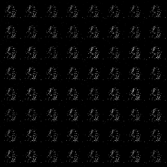

# CGAN-PyTorch

### Overview

This repository contains an op-for-op PyTorch reimplementation of [Conditional Generative Adversarial Networks](http://arxiv.org/pdf/1411.1784).

### Table of contents

1. [About Conditional Generative Adversarial Networks](#about-conditional-generative-adversarial-networks)
2. [Model Description](#model-description)
3. [Installation](#installation)
    * [Clone and install requirements](#clone-and-install-requirements)
    * [Download pretrained weights](#download-pretrained-weights-eg-mnist)
4. [Test](#test)
    * [Torch Hub call](#torch-hub-call)
    * [Base call](#base-call)
5. [Train](#train-eg-mnist)
6. [Contributing](#contributing)
7. [Credit](#credit)

### About Conditional Generative Adversarial Networks

If you're new to CGANs, here's an abstract straight from the paper:

Generative Adversarial Nets were recently introduced as a novel way to train generative models. In this work we introduce the conditional version of
generative adversarial nets, which can be constructed by simply feeding the data, y, we wish to condition on to both the generator and discriminator.
We show that this model can generate MNIST digits conditioned on class labels. We also illustrate how this model could be used to learn a multi-modal
model, and provide preliminary examples of an application to image tagging in which we demonstrate how this approach can generate descriptive tags
which are not part of training labels.

### Model Description

We have two networks, G (Generator) and D (Discriminator).The Generator is a network for generating images. It receives a random noise z and generates
images from this noise, which is called G(z).Discriminator is a discriminant network that discriminates whether an image is real. The input is x, x is
a picture, and the output is D of x is the probability that x is a real picture, and if it's 1, it's 100% real, and if it's 0, it's not real.

### Installation

#### Clone and install requirements

```bash
$ git clone https://github.com/Lornatang/CGAN-PyTorch.git
$ cd CGAN-PyTorch/
$ pip3 install -r requirements.txt
```

#### Download pretrained weights (e.g. mnist)

```bash
$ cd weights/
$ python3 download_weights.py
```

### Test

#### Torch hub call

```python
# Using Torch Hub library.
import torch
import torchvision.utils as vutils

# Choose to use the device.
device = torch.device("cuda") if torch.cuda.is_available() else torch.device("cpu")

# Load the model into the specified device.
model = torch.hub.load("Lornatang/CGAN-PyTorch", "cgan", pretrained=True, progress=True, verbose=False)
model.eval()
model = model.to(device)

# Create random noise image.
num_images = 64
noise = torch.randn([num_images, 100], device=device)
conditional = torch.randint(1, 2, (num_images,), device=device)

# The noise is input into the generator model to generate the image.
with torch.no_grad():
    generated_images = model(noise, conditional)

# Save generate image.
vutils.save_image(generated_images, "mnist.png", normalize=True)
```

#### Base call

Using pre training model to generate pictures.

```text
usage: test.py [-h] [--arch {cgan}] [--conditional {0,1,2,3,4,5,6,7,8,9}] [--num-images NUM_IMAGES] [--model-path MODEL_PATH] [--pretrained] [--seed SEED] [--gpu GPU]

optional arguments:
  -h, --help            show this help message and exit
  --arch {cgan}         model architecture: cgan. (Default: `cgan`)
  --conditional {0,1,2,3,4,5,6,7,8,9}
                        Specifies the generated conditional. (Default: 1)
  --num-images NUM_IMAGES
                        How many samples are generated at one time. (Default: 64)
  --model-path MODEL_PATH
                        Path to latest checkpoint for model. (Default: `weights/GAN-last.pth`)
  --pretrained          Use pre-trained model.
  --seed SEED           Seed for initializing testing.
  --gpu GPU             GPU id to use.

# Example (e.g. MNIST)
$ python3 test.py --arch cgan --conditional 1 --gpu 0
```

<span align="center">
</span>

### Train (e.g. MNIST)

```text
usage: train.py [-h] [--arch {cgan}] [--workers WORKERS] [--epochs EPOCHS] [--start-epoch START_EPOCH] [-b BATCH_SIZE] [--lr LR] [--image-size IMAGE_SIZE] [--channels CHANNELS] [--netD NETD] [--netG NETG] [--pretrained] [--world-size WORLD_SIZE]
                [--rank RANK] [--dist-url DIST_URL] [--dist-backend DIST_BACKEND] [--seed SEED] [--gpu GPU] [--multiprocessing-distributed]
                DIR

positional arguments:
  DIR                   Path to dataset.

optional arguments:
  -h, --help            show this help message and exit
  --arch {cgan}         Model architecture: cgan. (Default: `cgan`)
  --workers WORKERS     Number of data loading workers. (Default: 4)
  --epochs EPOCHS       Number of total epochs to run. (Default: 128)
  --start-epoch START_EPOCH
                        Manual epoch number (useful on restarts). (Default: 0)
  -b BATCH_SIZE, --batch-size BATCH_SIZE
                        The batch size of the dataset. (Default: 64)
  --lr LR               Learning rate. (Default: 0.0002)
  --image-size IMAGE_SIZE
                        Image size of high resolution image. (Default: 28)
  --channels CHANNELS   The number of channels of the image. (Default: 1)
  --netD NETD           Path to Discriminator checkpoint.
  --netG NETG           Path to Generator checkpoint.
  --pretrained          Use pre-trained model.
  --world-size WORLD_SIZE
                        Number of nodes for distributed training.
  --rank RANK           Node rank for distributed training. (Default: -1)
  --dist-url DIST_URL   url used to set up distributed training. (Default: `tcp://59.110.31.55:12345`)
  --dist-backend DIST_BACKEND
                        Distributed backend. (Default: `nccl`)
  --seed SEED           Seed for initializing training.
  --gpu GPU             GPU id to use.
  --multiprocessing-distributed
                        Use multi-processing distributed training to launch N processes per node, which has N GPUs. This is the fastest way to use PyTorch for either single node or multi node data parallel training.

# Example (e.g. MNIST)
$ python3 train.py --arch cgan --gpu 0 data
```

If you want to load weights that you've trained before, run the following command.

```bash
$ python3 train.py --arch cgan --netD weights/Discriminator_epoch8.pth --netG weights/Generator_epoch8.pth --start-epoch 8 --gpu 0 data
```

### Contributing

If you find a bug, create a GitHub issue, or even better, submit a pull request. Similarly, if you have questions, simply post them as GitHub issues.

I look forward to seeing what the community does with these models!

### Credit

#### Conditional Generative Adversarial Networks

*Mehdi Mirza, Simon Osindero*

**Abstract**

Generative Adversarial Nets were recently introduced as a novel way to train generative models. In this work we introduce the conditional version of
generative adversarial nets, which can be constructed by simply feeding the data, y, we wish to condition on to both the generator and discriminator.
We show that this model can generate MNIST digits conditioned on class labels. We also illustrate how this model could be used to learn a multi-modal
model, and provide preliminary examples of an application to image tagging in which we demonstrate how this approach can generate descriptive tags
which are not part of training labels.

[[Paper]](http://xxx.itp.ac.cn/pdf/1411.1784)

```
@article{DBLP:journals/corr/MirzaO14,
  author    = {Mehdi Mirza and
               Simon Osindero},
  title     = {Conditional Generative Adversarial Nets},
  journal   = {CoRR},
  volume    = {abs/1411.1784},
  year      = {2014},
  url       = {http://arxiv.org/abs/1411.1784},
  archivePrefix = {arXiv},
  eprint    = {1411.1784},
  timestamp = {Mon, 13 Aug 2018 16:48:15 +0200},
  biburl    = {https://dblp.org/rec/journals/corr/MirzaO14.bib},
  bibsource = {dblp computer science bibliography, https://dblp.org}
}
```